# 💻 Sistem Manajemen IT

**Sistem Manajemen IT** adalah aplikasi berbasis Power Platform yang dirancang untuk mengelola input data aktivitas tim Divisi IT di PT. HK Infrastruktur serta menyajikan data tersebut dalam bentuk dashboard interaktif untuk keperluan analisis dan monitoring.

---

## 🎯 Tujuan

Aplikasi ini bertujuan untuk menggantikan proses input manual menggunakan Excel dan mempermudah pemantauan data IT secara real-time melalui integrasi Power BI.

---

## 👥 Pengguna

- **Admin IT** – menginput, mengedit, dan mengelola data aktivitas serta user.
- **User Internal** – hanya dapat melihat data yang telah diinput dan visualisasi dashboard Power BI.

---

## 🚀 Fitur Utama

- **Input Form Data** – Admin dapat menginput data aktivitas IT secara digital.
- **View Form Data** – User dapat melihat data yang telah diinput melalui interface Power Apps.
- **Dashboard Power BI** – Visualisasi data aktivitas secara interaktif dan real-time langsung di Power Apps.
- **Manajemen User** – Role-based access untuk admin dan user internal.
- **Ekspor Laporan** - Ekspor langsung laporan dashboard Power-BI ke email user.

---

## 🔧 Teknologi yang Digunakan

- **Power Apps Canvas** – Untuk membangun antarmuka input & view data.
- **Power Automate** – Untuk mengotomatiskan refresh Power BI & Ekspor Laporan via Email.
- **Power BI Tile** – Untuk menampilkan visualisasi langsung di dalam Power Apps.
- **SharePoint List** – Sebagai penyimpanan data utama.

---

## 🖼️ Screenshots Tampilan Aplikasi

>**Tampilan Home**
><br>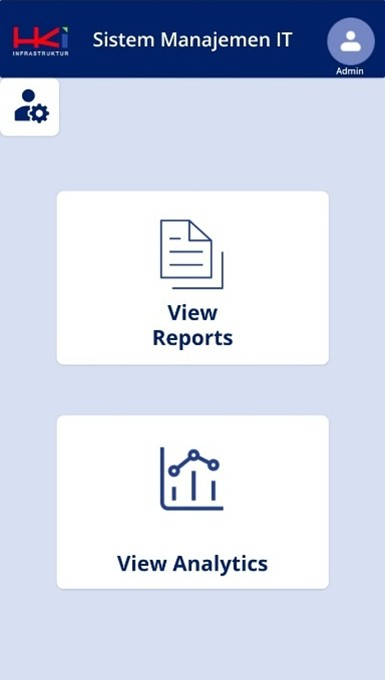

>**Tampilan Dashboard Admin**
>|Dashboard Home|Manage User|
>|--------------|-----------|
>|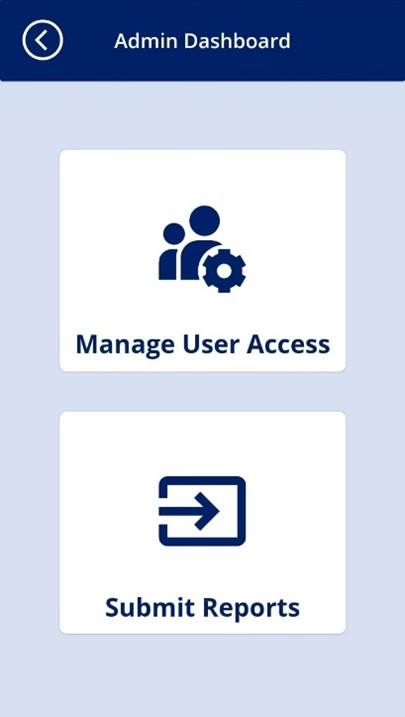|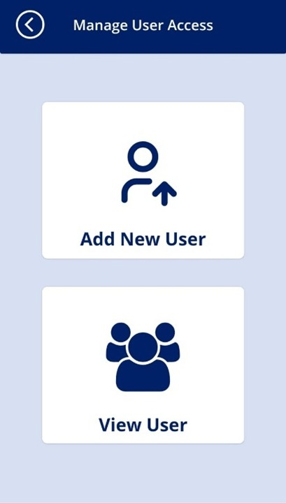|

>**Manage User**
>|Add New User|User Detail|User Full Info|
>|------------|-----------|-------|
>|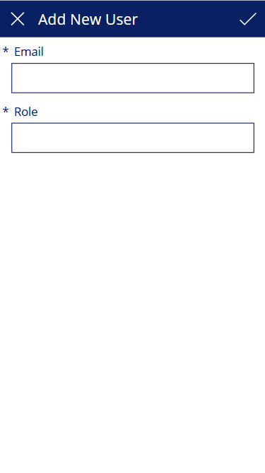| 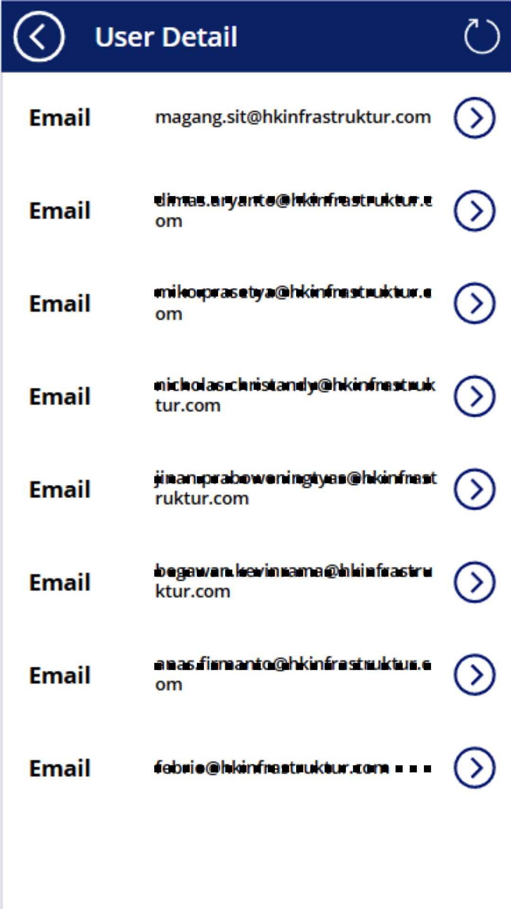|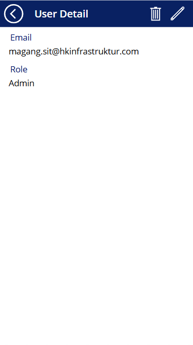

>**Submit Form**
>|Form Menu|Add New Data|
>|---------|------------|
>|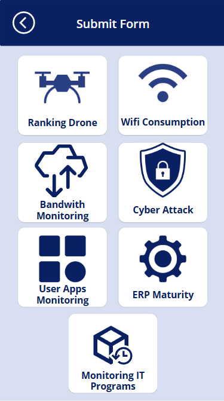|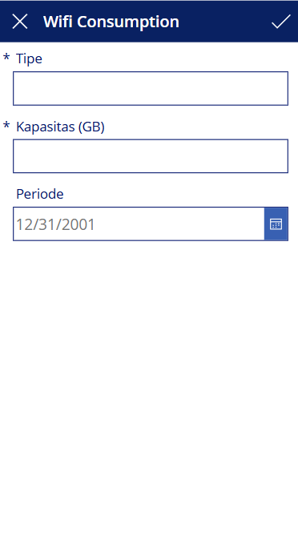

>**View Report**
>|View Form Menu|Form Detail|Form Full Info|
>|-------------|--------|---------|
>||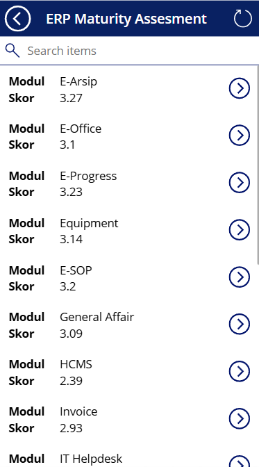|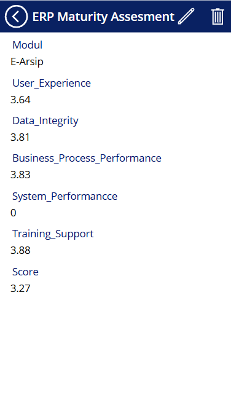

>**Dashboard Analytics**
><br>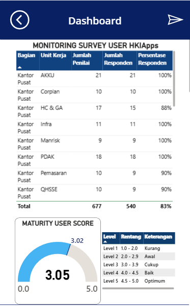

---


---

## 📁 Struktur Solusi (Unpacked)

Struktur folder hasil unpack dari solution Power Platform:
```
SistemManajemenIT/
├── CanvasApps/
├── Workflows/
├── Dashboards/
├── Other/
├── .gitignore
├── README.md
```
